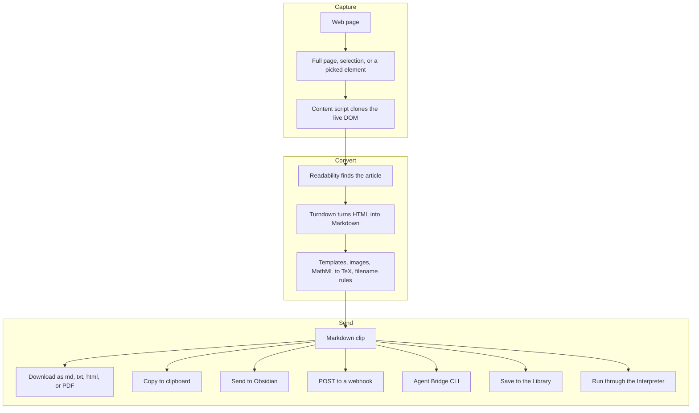

# MarkSnip

Webpage to Markdown clipper for Chrome and Firefox. Turn any page into clean Markdown and send it wherever you keep notes: a file, the clipboard, Obsidian, a webhook, or a local CLI.

[Chrome Web Store](https://chromewebstore.google.com/detail/marksnip-markdown-web-cli/kcbaglhfgbkjdnpeokaamjjkddempipm?hl=en) | [Firefox Add-ons](https://addons.mozilla.org/en-US/firefox/addon/marksnip-markdown-web-clipper/) | [User Guide](docs/guides/user-guide.md) | [Agent Bridge Walkthrough](docs/guides/agent-bridge.md) | [Changelog](CHANGELOG.md) | [Privacy Policy](PRIVACY.md)

[](https://www.youtube.com/watch?v=IO6PjI79drY)

## What it is

MarkSnip is a Manifest V3 fork of [MarkDownload](https://github.com/deathau/markdownload/). It clips the readable part of a page, converts it to Markdown you can edit, and gets out of your way. The conversion runs entirely in the browser, and nothing leaves your machine unless you turn on a feature that sends it somewhere.

Under the hood, a clip flows through one pipeline before it lands at whatever destination you pick:



## Features

### Capture

- Clip the full page, just your selection, or a single element you choose with the Element Picker.
- Reader View opens a distraction-free version of the article, either as an in-page overlay or in its own tab, with live controls for text size, width, line height, theme, and font.
- The Highlighter marks text and page elements. Saved highlights live in a manager, carry into Reader View, and can be folded into the clipped Markdown.
- Click & Clip steps through interactive pages (tabs, accordions, load-more, pagination, sidebars) and captures each state so you do not have to copy every view by hand.
- Batch mode converts a list of URLs or markdown links, with a visual picker for grabbing links off the current page.
- Collapsed and hidden sections (FAQ answers and the like) are kept by default. Flip on Skip Hidden Content when you want a strict visible-only clip.

### Convert

- Mozilla Readability handles extraction; Turndown handles HTML to Markdown.
- MathML and MathJax export as TeX instead of flattening into mangled text.
- Code blocks keep their line breaks, with optional language auto-detection.
- GitHub-flavored Markdown tables, with controls for links, formatting, and alignment.
- Templates support front matter, back matter, and chainable variable filters such as `:slugify`, `:ascii`, casing, and `publishedTime` date formatting.
- Site Rules apply per-site overrides for templates, images, download folders, and tables.

### Edit and preview

- A CodeMirror editor with syntax highlighting and a rotating character, word, and token counter.
- A rendered Markdown preview you can toggle without leaving the popup.

### Export and send

- Export a popup clip as Markdown, plain text, HTML, or PDF, with a configurable default format.
- Save batch output as a ZIP, as individual files, or as one combined Markdown document.
- Copy to the clipboard, or hand the clip to an AI assistant (ChatGPT, Claude, Perplexity, or a custom URL).
- Send to Obsidian through the Advanced URI plugin.
- POST clips to your own webhook with templated headers and a JSON body.
- Pull the current tab from local tools through the Agent Bridge CLI.
- Keep clips in a local Library inside the browser and revisit them later.

### Interpreter (optional, opt-in)

Run your own prompts against a clip through an LLM provider you configure, then drop the response back into the Markdown or the title before export. Bundled provider presets cover Anthropic, OpenAI, Azure OpenAI, Google Gemini, DeepSeek, Hugging Face, Meta, Ollama, OpenRouter, Perplexity, and xAI. The presets live in [`providers.json`](providers.json) and can be refreshed remotely. This is off until you enable it and add a key.

### Interface

- Ten display languages plus Auto: English, Spanish, French, German, Italian, Brazilian Portuguese, Simplified Chinese, Japanese, Korean, and Hindi.
- Light, dark, and system themes, accent colors, a compact layout, color-blind palettes, and a handful of special themes.
- Context-menu items and keyboard shortcuts you can show, hide, or rebind.
- Import and export all settings as JSON.

## Screenshots

| Clip an article | Markdown preview | Dark mode |
| --- | --- | --- |
|  |  |  |

| Options | Batch processing |
| --- | --- |
|  |  |

## Install

### Chrome

Install from the [Chrome Web Store](https://chromewebstore.google.com/detail/marksnip-markdown-web-cli/kcbaglhfgbkjdnpeokaamjjkddempipm?hl=en).

### Firefox

Install from [Firefox Add-ons](https://addons.mozilla.org/en-US/firefox/addon/marksnip-markdown-web-clipper/).

### Load unpacked (Chrome)

1. `cd src`
2. `npm ci`
3. `npm run build:manifests`
4. Open `chrome://extensions`
5. Enable Developer mode
6. Click **Load unpacked** and select `src/.build/chrome`

### Load unpacked (Firefox)

1. `cd src`
2. `npm ci`
3. `npm run build:manifests`
4. Load `src/.build/firefox` as a temporary add-on in Firefox, or package it with the release workflow.

## Usage

### The popup

1. Click the MarkSnip icon to open the popup.
2. Choose **Selection** or **Document**.
3. Review or edit the Markdown in the editor.
4. Use the export button to save the clip as Markdown, plain text, HTML, or PDF, or use **Copy All** or **Send to Obsidian** for Markdown-based workflows.

The popup export format only affects popup exports. Context menus, keyboard download shortcuts, batch exports, Library exports, Agent Bridge, and Obsidian actions stay Markdown-based.

### Reader View

Open Reader View from the popup, the right-click menu, or a browser shortcut you assign. It can show the article as an overlay on the page or in a dedicated reader tab. A reader article includes an outline, footnotes, and an image lightbox, plus direct actions to copy Markdown, download Markdown, or send the article to Obsidian. Highlights you made on the page come with it.

### Batch and Click & Clip

1. Open the popup and click the batch icon.
2. Paste URLs (or markdown links), one per line, or use **Pick Links from Page**.
3. For pages that reveal content through clicks rather than links, use Click & Clip to capture tabs, accordions, load-more flows, pagination, and sidebars.
4. Choose ZIP, individual files, or one combined document, then run the conversion.

### Interpreter

1. Open Settings and enable the Interpreter.
2. Pick a provider and model, and add an API key if the provider needs one.
3. Write a prompt with the `{{content}}` placeholder where the clip should go.
4. Run it from the popup. The response is inserted into the Markdown or the title before you export.

Keys stay out of saved config unless you choose to remember them, and an export warning shows up when AI-generated content may be sent onward.

### Agent Bridge

The Agent Bridge lets local tools ask MarkSnip for the current tab without downloading a file first. The CLI only talks to the browser on your own machine.

1. Install the matching companion archive from GitHub Releases.
2. Run the install command for your OS:

   - Windows: `.\marksnip.exe install-host`
   - macOS/Linux: `./marksnip install-host`
3. Enable **Agent Bridge** in MarkSnip Settings and approve the native messaging prompt if it appears.
4. Run the clip command for your OS:

   - Windows: `.\marksnip.exe clip`
   - macOS/Linux: `./marksnip clip`

For local unpacked Chrome testing on Windows, look up the unpacked extension ID first:

```powershell
powershell -ExecutionPolicy Bypass -File .\tools\find-unpacked-chrome-extension-id.ps1 -ExtensionPath .\src
```

On any platform you can also copy the unpacked extension ID from `chrome://extensions`. Then install the host against that ID:

```powershell
cd .\native
.\marksnip.exe install-host --chrome-extension-id <YOUR_UNPACKED_EXTENSION_ID>
```

```bash
cd ./native
./marksnip install-host --chrome-extension-id <YOUR_UNPACKED_EXTENSION_ID>
```

If the unpacked Chrome extension ID changes later, rerun that command with the new ID.

## Keyboard shortcuts

- `Alt+Shift+M`: open the popup
- `Alt+Shift+D`: download the current tab as Markdown
- `Alt+Shift+C`: copy the current tab as Markdown
- `Alt+Shift+L`: copy the current tab URL as a Markdown link

More commands (selection, selected tabs, Obsidian actions, and Reader View toggle) ship without a default key and can be bound in your browser's shortcut settings. The popup export format does not change these shortcut or context-menu actions; they stay Markdown-based.

## Development

All development commands run from `src/`.

### Prerequisites

- Node.js 20+
- npm

### Setup

```bash
cd src
npm ci
```

### Common scripts

- `npm test`: run the Jest suite
- `npm run test:unit`: unit tests
- `npm run test:integration`: integration tests
- `npm run test:e2e`: Playwright end-to-end tests
- `npm run lint:js`: ESLint
- `npm run audit:i18n`: check locale key parity and exact-English fallback strings
- `npm run build:manifests`: generate the browser-specific manifests and release highlights
- `npm run build`: Firefox package build via `web-ext`
- `npm run build:chrome`: Chrome ZIP package
- `npm run build:all`: build the Firefox and Chrome artifacts
- `npm run verify:firefox`: focused Firefox unit tests, the live smoke run, and `web-ext lint`

For the Agent Bridge companion, build the Go binaries from `native/`:

```bash
go build ./cmd/marksnip
go build ./cmd/marksnip-native-host
```

### i18n audit

The locale audit checks key parity and flags strings that are still the exact English text:

```bash
npm run audit:i18n
```

Useful options:

```bash
npm run audit:i18n -- --json
npm run audit:i18n -- --locale de,fr,pt_BR
npm run audit:i18n -- --include-invariants
npm run audit:i18n -- --fail-on-untranslated
npm run audit:i18n -- --allow-key someIntentionalEnglishKey
```

## Build architecture

`src/manifest.json` is the source manifest. `src/scripts/generate-browser-manifests.js` produces:

- `src/.build/chrome/manifest.json` with `background.service_worker`
- `src/.build/firefox/manifest.json` with `background.scripts`

The `.build/` directory is generated output and is not committed. Root-level `dist/` holds packaged release artifacts, and root-level `tmp/` is ignored local scratch space.

## Release flow

GitHub Actions workflow [`.github/workflows/build-release.yml`](.github/workflows/build-release.yml):

1. Runs unit and integration tests.
2. Builds the browser manifests.
3. Packages the artifacts:
   - `marksnip-chrome-<version>.zip`
   - `marksnip-firefox-<version>.xpi`
   - `marksnip-agent-bridge-windows-amd64.zip`
   - `marksnip-agent-bridge-macos-amd64.tar.gz`
   - `marksnip-agent-bridge-macos-arm64.tar.gz`
   - `marksnip-agent-bridge-linux-amd64.tar.gz`
4. Publishes a GitHub Release on `v*` tags (or a manual `workflow_dispatch`).

To publish:

1. Update the version in `src/manifest.json`.
2. Update `CHANGELOG.md`.
3. Tag and push, for example:

```bash
git tag v5.2.0
git push origin v5.2.0
```

## Project structure

```text
.
|- docs/
|  |- compliance/permissions.md
|  |- guides/agent-bridge.md
|  |- guides/user-guide.md
|  `- store-screenshots/
|- native/                 # Go Agent Bridge CLI and native messaging host
|  |- cmd/
|  `- internal/bridge/
|- src/
|  |- background/          # Readability, Turndown, GFM, moment
|  |- contentScript/       # clipping, highlighter, reader overlay
|  |- offscreen/           # offscreen conversion and reader semantics
|  |- reader/              # Reader View surface
|  |- highlights/          # highlights manager
|  |- notifications/
|  |- options/
|  |- popup/
|  |- print/
|  |- scripts/
|  |- shared/              # conversion, template, webhook, interpreter, i18n utils
|  |- tests/               # unit, integration, e2e
|  |- _locales/            # 10 language catalogs
|  `- manifest.json
|- tools/
|  `- find-unpacked-chrome-extension-id.ps1
|- providers.json          # Interpreter provider presets
|- CHANGELOG.md
|- PRIVACY.md
`- LICENSE
```

## Privacy

By default, MarkSnip does not send clipped page content to any external server. Two opt-in features can send content out, and only when you turn them on: the Interpreter sends a clip's Markdown to an LLM provider you configure, and the Agent Bridge sends it to a local CLI on your own machine. Webhook targets are restricted to public HTTPS hosts. See [PRIVACY.md](PRIVACY.md) for the full breakdown.

## Credits

- Original [MarkDownload](https://github.com/deathau/markdownload/) by deathau
- [Readability.js](https://github.com/mozilla/readability)
- [Turndown](https://github.com/mixmark-io/turndown)
- [CodeMirror](https://codemirror.net/)
- [highlight.js](https://highlightjs.org/)

## License

This project is licensed under the [PolyForm Noncommercial License](LICENSE).
